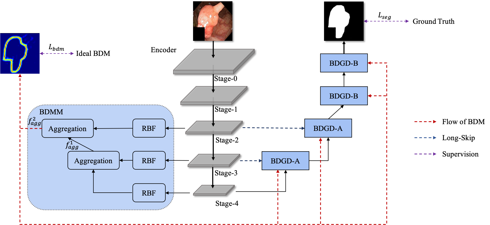
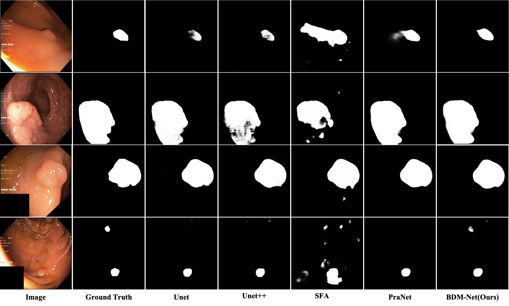

# BDM-Net
This is the offical implementation of BDM-Net

## 1. Overall Architecture

      
    <em> 
    Figure 1: Overall architecture of BDM-Net.
    </em>

## 2. Visual Results

      
    <em> 
    Figure 2: Visual results on Kavsir dataset.
    </em>

## 3. Train/Test/Evaluate

### 3.1. Requirements 

torch

[pytorch-lightning](https://github.com/PyTorchLightning/pytorch-lightning)

[segmentation_models.pytorch](https://github.com/qubvel/segmentation_models.pytorch)

[albumentations](https://github.com/albumentations-team/albumentations)

..

### 3.2 Download Necessary Data

Data can be found on [GoogleDrive](https://drive.google.com/drive/folders/1AQHCJ0kdOQl9j8OWfmXS4oeD6nQ9lUhd?usp=sharing), including train dataset, test dataset, and resultmap.

### 3.3. Train

Run `python train.py` to train on default setting.

To specify sigma, run `python train.py -s5`

### 3.4. Test

Run `python MyTest.py` to save the result map.

### 3.5. Evaluate 

The evaluation matlab code can be found in [PraNet](https://github.com/DengPingFan/PraNet), we use the same evaluation method as PraNet.

## 4. Citation

Please cite our paper if you find the work useful:
